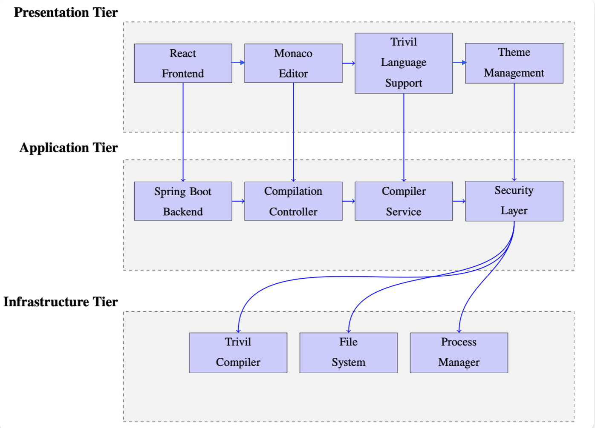

# A web playground for Trivil programming language
An interactive web-based development environment for the Trivil programming language, featuring real-time code compilation, execution, and syntax analysis.
It is available on https://trivilplayground.innopolis.university

## Overview

Trivil Playground consists of:
- **Frontend**: React TypeScript application with Monaco Editor
- **Backend**: Spring Boot REST API with Trivil compiler integration
- **Compiler**: Trivil language compiler (Go-based)

It's not a complete build. It's a demonstrational version to peak into what is under the hood of the project. There are several setting steps should be performed after cloning the repository. Use aforementioned link to interact with product.

## Features

- Code execution
- Dynamic syntax highlighting
- Hover information
- Error recognition
- Autocompletion
- Responsive UI
- Execution time measurement 
- Dark/Light themes

## Architecture

## API Documentation

### Backend Endpoints

#### Compilation
- **POST** `/api/compile`
  - Compile and execute Trivil code
  - Request: `{"sourceCode": "string"}`
  - Response: `{"success": boolean, "output": "string", "executionTimeMs": number}`

#### Syntax Analysis
- **POST** `/api/syntax/analyze`
  - Analyze syntax and get tokens
  - Request: `{"sourceCode": "string", "position": number}`
  - Response: `{"success": boolean, "tokens": [...]}`

#### Health Check
- **GET** `/api/health`
  - Check service health
  - Response: `"Service is healthy"`

## Security Considerations

- CORS is configured to allow specific origins only
- Source code length is limited to prevent abuse
- Execution timeout prevents infinite loops
- Temporary files are automatically cleaned up
- Input validation on all API endpoints

## Changelog

### v1.0.0
- Initial Release
